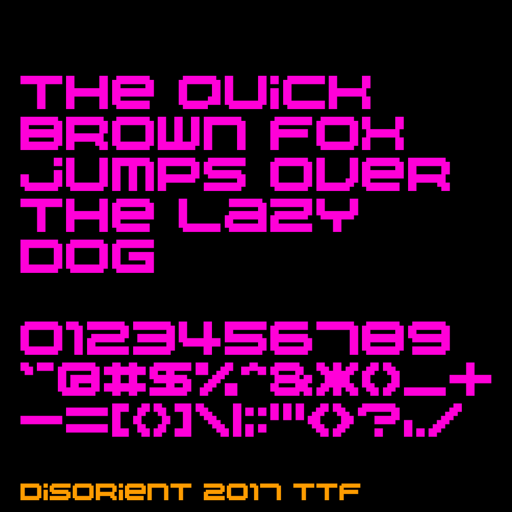

The "Disorient 2017" font (designed by The Eye and programmed by Jacob J.) is an update and a simplification of the Disorient font. In an effort to make the font more legible while keeping its distinctive character, many letters have been fine-tuned. Also, both upper and lower cases display the same character, so you really can't go wrong. We encourage the use of this font over previous versions.

The Disorient logo is used on our Signs, D-shirt, Urn, Disorient Pattern, etc. Every Disorient camper is encouraged to use the Disorient logo and the Disorient font for Disorient-related projects.

Disorient logo and fonts should not be distorted in X or Y. Space between each 8 point letter should be one single pixel. The proportions of the letters, kerning, etc. should remain as shown on this page.

More about Disorient fonts at the [Disorient Wiki](http://wiki.disorient.info/index.php?title=Disorient_logo#Disorient_2017).

**Status:** Experimental, but working. There are validation errors when installing on OS X, but it will let you override them.

## Download

[Disorient_2017_0001.ttf](./releases/Disorient_2017_0001.ttf)

## About Development

The font is generated with [Processing](https://processing.org/) and the [Fontastic Processing Library](http://code.andreaskoller.com/libraries/fontastic/).

Each glyph is entered in as data, then exported to a True Type Font (TTF). Since each font starts as data, it can potentially be used in other types of projects, such as interactive works and animations. A future possibility is to export the data into other common formats, such as JSON, so it can be easily imported into other languages besides Processing.
